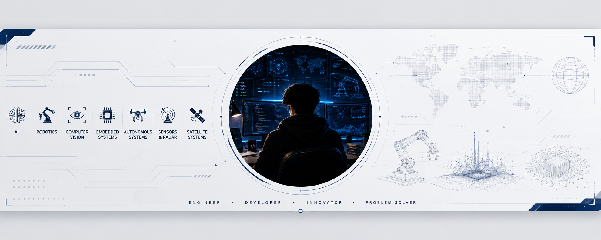

  

<h1 align="center">Hi 👋, I'm Kaan</h1>
<h3 align="center">Software Engineer focused on AI, Robotics & Autonomous Systems</h3>

- 🔭 I'm currently working on [smart-factory-orchestrator](https://github.com/kaandevs-ops/smart-factory-orchestrator)
- 🌱 I'm currently learning **AI, Robotics, Computer Vision, Autonomous Systems and Open Source Engineering Projects**
- 📫 How to reach me: **kaantekin06@icloud.com**

<h3 align="left">💻 Connect with me:</h3>

&nbsp;&nbsp;&nbsp;

<h3 align="left">🛠️ Languages and Tools:</h3>

 
 
 
 
 
 
 
 
 
 
 
 
 
 
 
 
 
 
 
 
 

<!-- color -- 434d58 -->

<h3 align="left">📊 GitHub Stats:</h3>

  
  

<h3 align="left">📈 Activity Graph:</h3>

