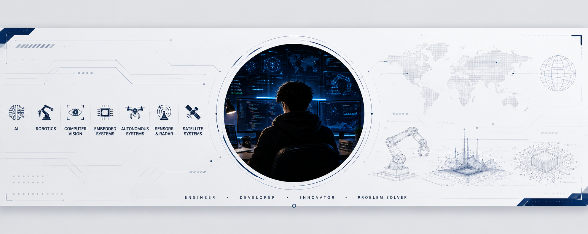

<div align="center">

<div align="center">
  
</div>


<br/>


[](mailto:kaantekin06@icloud.com)
[](https://github.com/kaandevs-ops)


</div>

<br/>

## 🟣 About Me

I'm **Kaan**, a student in Türkiye studying Information Systems & Technologies, and I spend most of my free time building things — mostly around AI, backend systems, and anything with a "how does this actually work" itch. I like projects that combine a few hard problems at once: an event pipeline that has to stay in sync, a model that has to make a decision in real time, a map that has to update without lagging out.

I care more about a project actually working end-to-end than about it looking impressive on paper. If something's half-broken, I'd rather say so than dress it up.

- 🔭 Working on **smart-factory-orchestrator** — an event-driven orchestration platform exploring predictive maintenance, AGV coordination, and digital twin simulation
- 🌱 Learning more about **AI systems, robotics, and computer vision** as I go
- 🛰️ Curious about **embedded systems and sensor fusion** — still early days here
- 💬 Comfortable building full-stack projects with AI pieces wired in
- 📫 kaantekin06@icloud.com

**Open to:** internships or junior roles in AI/ML, backend, or robotics · open-source collaboration · people who want to build something together

---


## 🟣 Tech Stack

<div align="center">

**Languages**
<br/>


**Frontend**
<br/>


**Backend & Databases**
<br/>


**Cloud, DevOps & Tooling**
<br/>


</div>

---

## 🟣 What I Work With

```text
Core
  Python · C# · TypeScript · Java

AI / ML
  LLM-integrated apps · RAG · Computer vision · Local/offline inference

Systems
  Event-driven architecture · Real-time data pipelines · Simulation

Still learning
  Sensor fusion · Robotics · Distributed systems
```

---

## 🟣 Featured Projects

<details open>
<summary><b>🏭 smart-factory-orchestrator</b></summary>
<br/>

An event-driven orchestration platform I'm building to explore predictive maintenance, AGV coordination, and digital twin simulation on one shared backbone.

| | |
|---|---|
| **Stack** | Python, event-driven architecture, multi-LLM core |
| **Focus** | Keeping orchestration, robotics coordination, and analytics decoupled but talking to each other |
| **Repo** | [smart-factory-orchestrator](https://github.com/kaandevs-ops/smart-factory-orchestrator) |

</details>

<details>
<summary><b>🛰️ SENTINEL</b></summary>
<br/>

A real-time geospatial visualization project — pulls in aircraft, satellite, weather, and other public data feeds and renders them on a 3D globe.

| | |
|---|---|
| **Stack** | Python, 3D visualization, live data aggregation |
| **Focus** | Pulling from 12+ public sources and keeping the render smooth as data streams in |
| **Repo** | [SENTINEL](https://github.com/kaandevs-ops/SENTINEL) |

</details>

<details>
<summary><b>🤖 kodai</b></summary>
<br/>

A Turkish-language coding assistant that runs fully offline on Apple MPS using Qwen2.5-Coder — no API calls, no cloud dependency.

| | |
|---|---|
| **Stack** | Python, Qwen2.5-Coder, Apple MPS |
| **Focus** | Proving a genuinely useful coding assistant doesn't need a cloud backend |
| **Repo** | [kodai](https://github.com/kaandevs-ops/kodai) |

</details>

<details>
<summary>More projects</summary>
<br/>

**📡 turkiye-radar** — Interactive map tracking earthquakes, weather, and other public events across Turkey, with AI-assisted summaries. [Repo](https://github.com/kaandevs-ops/turkiye-radar)

**💬 html-ai** — A local, memory-persistent AI assistant with Telegram/WhatsApp integration, running entirely on Ollama. [Repo](https://github.com/kaandevs-ops/html-ai)

</details>

---

## 🟣 Currently

```yaml
building:
  - smart-factory-orchestrator
  - SENTINEL

learning:
  - multi-agent LLM orchestration
  - sensor fusion basics
  - digital twin simulation

open_to:
  - internships / junior roles in AI, ML, or backend
  - open-source collaboration
```

---

## 🟣 Connect

<div align="center">

[](mailto:kaantekin06@icloud.com)
[](https://github.com/kaandevs-ops)

</div>

---

<div align="center">

*Still learning, still shipping.*


</div>
